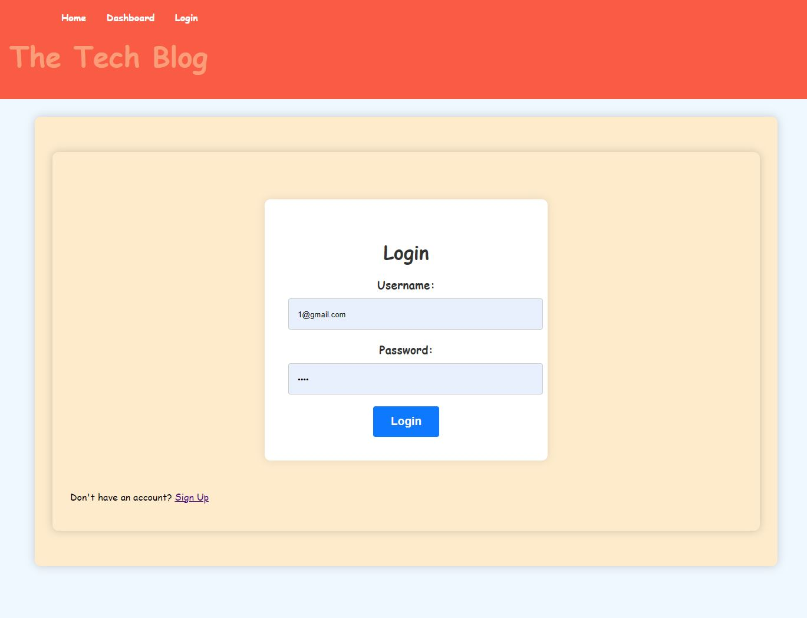

# MVC-TechBlog
This is Tech Blog application based on Model-View-Controller (MVC) and it is deployed in Heroku.

Github Link
https://github.com/sagagi74/MVC-TechBlog

Heroku Link
https://yong-mvc-techblog-4f5b5ab7b567.herokuapp.com/

GIVEN a MVC Thch-blog site

- First Visit:
When you visit the site for the first time, you’ll see the homepage displaying existing blog posts (if there are any). You’ll also find navigation links to the homepage and the dashboard, along with an option to log in.

- Navigating the Homepage:
Clicking on the homepage option takes you right back to the homepage.

- Exploring Other Links:
If you click on any other navigation links, you'll be prompted to either sign up or sign in.

- Signing Up:
!Need more than 7 digits of paswords length!
Choosing to sign up? You’ll be asked to create a username and password.

- Completing Sign-Up:
Clicking the sign-up button saves your user credentials and logs you into the site automatically(dashboard).

- Returning to the Site:
Coming back later? Just choose to sign in and enter your username and password and it will direct to dashboard.

- Logged In View:
When signed in, you’ll see navigation links for the homepage, the dashboard, and an option to log out.

- Browsing the Homepage:
Clicking on the homepage option in the navigation takes you to the homepage, where you can see existing blog posts with their titles and creation dates.

- Viewing a Blog Post:
Clicking on a blog post presents you with the post title, contents, creator’s username, and the date it was created. You can also leave a comment if you’d like.

- Adding a Comment:
Enter your comment and click submit while signed in. Your comment will be saved and displayed with your username and the date it was created.

- Accessing the Dashboard:
Clicking on the dashboard option in the navigation takes you to the dashboard. Here, you can see your blog posts and have the option to add a new one.

- Creating a New Post
Clicking the button to add a new blog post prompts you to enter a title and contents for your post Clicking the button to create a new post saves your post and takes you back to an updated dashboard showing your new post.

- Managing Your Posts:
Clicking on one of your existing posts in the dashboard allows you to delete or update it, and then takes you back to the updated dashboard.

- Logging Out:
Clicking the logout option in the navigation signs you out of the site.

- Inactivity Logout:
If you’re idle on the site for a while, you can still view posts and comments, but you’ll need to log in again before you can add, update, or delete posts.

